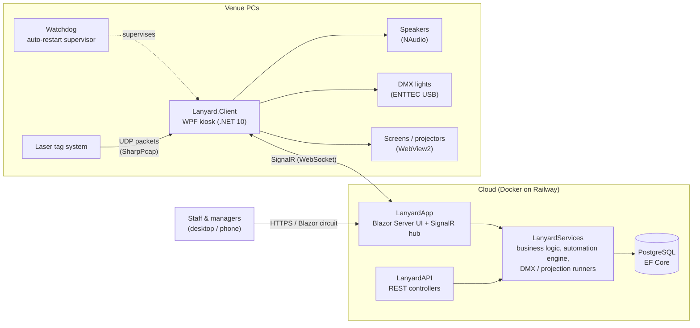

# Lanyard

**A venue operations platform for entertainment centres: staff management, training and
compliance, plus real-time control of the on-site hardware (music, lighting, projection
and laser tag scoring) from one web app.**

Lanyard is built for a real laser tag / family entertainment business, where it replaces the
original [Zone Laser Scoreboard](https://github.com/benjamano/Zone-Laser-Scoreboard). It has two
halves:

- a **cloud-hosted Blazor Server web app**, used by managers and staff from a desktop or a phone
- a **Windows kiosk client** installed on the venue's PCs, which drives the physical hardware
  and takes commands from the server in real time over SignalR


---

## What it does

### Staff and business management
- **Users, roles and multi-location companies.** Role-based access, per-company theming and
  logos, and location-scoped data, so one deployment can serve several sites.
- **Training courses.** Managers build step-by-step courses, assign them to staff (automatically
  by location or by hand), track completion on an analytics dashboard, and send email reminders.
- **Onboarding and staff documents.** Automated welcome/onboarding emails with attachments, plus
  staff document tracking (certificates, right-to-work and so on) with per-document expiry reminders.
- **Announcements, clock-in and a file manager** with folders, drag-and-drop and previews.
- **Customisable dashboards.** Configurable widgets (training progress, announcements, a live
  projection status widget, a laser tag Hall of Fame leaderboard). Any dashboard can be set as the
  home screen.
- **Security and compliance.** ASP.NET Core Identity with two-factor authentication, account
  lockout, invite-by-email, default-deny route authorisation, and GDPR data-retention tooling.

### Real-time venue control
- **Music.** Playlists and a song library, played on the venue PCs and controlled remotely from
  any phone (play/pause/skip/volume).
- **DMX lighting.** A virtual lighting desk in the browser with fixtures, scenes and BPM-synced
  chases, sent out through an ENTTEC Open DMX USB interface on the kiosk.
- **Projection programs.** Templated, parameterised content sequences (scoreboards, live camera
  feeds, media) that run on the venue's screens and projectors, with the playback loop run on the
  server.
- **Live laser tag scoring.** The kiosk captures the laser tag system's UDP broadcast traffic
  (SharpPcap), turns it into game state and scores, and saves game results.
- **Live video.** WebRTC camera streaming from a kiosk to projection screens, with the server
  handling signalling.
- **Automation engine.** "When X, do Y" rules triggered by game state changes, schedules or idle
  time, for example "when a game starts, switch the lighting scene and change the playlist".

---

## Architecture



The server is the source of truth. It runs the DMX scene and projection program timing loops as
singleton services, and the kiosk clients act as thin executors that receive commands and report
state back. So a phone on the venue floor can start a lighting scene, the automation engine can
react to a game ending, and several screens stay in sync, all through one SignalR hub.

---

## Tech stack

| Area | Technologies |
|---|---|
| Web app | .NET 10, ASP.NET Core, Blazor Server (Interactive Server rendering), Fluent UI Blazor v5, Fluent UI Charts |
| Real-time | SignalR (server hub and .NET client), WebRTC for video |
| Data | PostgreSQL, Entity Framework Core (Npgsql + NetTopologySuite), code-first migrations |
| Auth | ASP.NET Core Identity, 2FA, role-based and default-deny route authorisation |
| Kiosk client | WPF + WebView2, NAudio / NLayer (audio), FTDI / ENTTEC Open DMX (lighting), SharpPcap / PacketDotNet (packet capture), Velopack (auto-update) |
| Other | Resend (transactional email), QuestPDF, QRCoder, HtmlSanitizer, OpenTelemetry |
| Customer site | .NET MAUI Blazor Hybrid + an ASP.NET Core host sharing one Razor class library (`Lanyard.Reach`) |
| Testing | MSTest, Moq, EF Core InMemory, `WebApplicationFactory` integration tests, Coverlet |
| DevOps | GitHub Actions CI, Docker, Railway (continuous deployment from `main`), Velopack release pipeline for the client |

---

## Engineering highlights

- **Layered, interface-driven design.** UI and API → services → infrastructure. Every service has
  an `I*Service` interface registered in DI, which is what makes the Moq-based test suite possible.
- **`Result<T>` error model.** Services return `Result<T>.Ok` / `Result<T>.Fail` for expected
  failures instead of throwing, so callers always know what can go wrong.
- **Safe EF Core usage in long-lived services.** Singletons (music player, automation engine, DMX)
  use `IDbContextFactory` with one context per unit of work, and read queries use `AsNoTracking()`
  plus call-site SQL tagging so slow queries can be traced back to the code that issued them.
- **Server-owned real-time playback.** DMX scenes and projection programs are stepped by singleton
  runner services on the server, with locking for thread safety. Kiosks only render what they're told,
  so every screen and light stays consistent.
- **Resilient kiosks.** A watchdog process restarts the client after crashes (with crash-loop
  protection), the client reconnects to SignalR on its own, and Velopack updates it on the next restart.
- **Default-deny routing.** Every page must explicitly declare `[Authorize]` or `[AllowAnonymous]`.
  A page that forgets is locked down, not exposed.
- **Soft deletes and GDPR retention** instead of hard deletes, documented in
  [`docs/DATA_RETENTION.md`](docs/DATA_RETENTION.md).
- **690+ automated tests** covering service logic plus real-pipeline integration tests (auth,
  routing, controllers). CI builds, tests, reports coverage on each PR, checks that the Docker image
  builds, and blocks merges that don't bump the app version.
- **User-facing changelog.** Every user-visible change ships with a release-notes entry that
  appears in the app's "What's new" panel.

---

## Repository layout

```
src/
├── Lanyard.Server/
│   ├── LanyardApp/         Blazor Server web app, SignalR hub, composition root (Program.cs)
│   ├── LanyardAPI/         REST API controllers
│   └── LanyardServices/    Business logic: training, automation, DMX, projection, music, email, ...
├── Lanyard.Infrastructure/ EF Core DbContext, entity models, migrations
├── Lanyard.Shared/         DTOs and enums shared between server and kiosk client
├── Lanyard.Client/         WPF kiosk client (audio, DMX, projection windows, packet sniffing)
├── Lanyard.Client.Watchdog/ Supervisor that keeps the kiosk client running
├── Lanyard.Reach/          Customer-facing site (MAUI Blazor Hybrid + web host, shared UI)
└── Lanyard.Tests/          MSTest unit and integration tests
```

Contributor conventions are covered in [`AGENTS.md`](AGENTS.md) and [`CONTRIBUTING.md`](CONTRIBUTING.md).

---

## Local development

**Prerequisites:** .NET 10 SDK, Docker, and the `dotnet-ef` tool (`dotnet tool install -g dotnet-ef`).

1. Start a throwaway PostgreSQL (plus an optional Adminer UI at http://localhost:8081):

   ```bash
   docker compose up -d
   ```

2. Apply the migrations:

   ```bash
   dotnet ef database update \
     --project src/Lanyard.Infrastructure \
     --startup-project src/Lanyard.Server/LanyardApp
   ```

3. Run the server with `dotnet run` in `src/Lanyard.Server/LanyardApp`, or use the
   **Debug LanyardApp** launch config in VS Code, which also starts the database container.

4. Run the tests:

   ```bash
   dotnet test src/Lanyard.Tests/Lanyard.Tests.csproj
   ```

The development connection string lives in `appsettings.Development.json` and points at the
container defined in `docker-compose.yml`. Stop the database with `docker compose down` (add `-v`
to wipe the data volume too).

### Production configuration

The production connection string is supplied at runtime through the
`ConnectionStrings__DefaultConnection` environment variable. It is never committed to
`appsettings.json`, and the app refuses to start without it.

---

## Running the kiosk client

The Lanyard Client is a Windows desktop app that runs on the venue's kiosk PCs. It handles local
music playback, projection displays, DMX lighting and laser tag packet capture.

1. Download the latest `LanyardClient-win-Setup.exe` from [Releases](../../releases) and run it.
2. On first launch you'll be asked for the server URL (`https://localhost:7175` if the server is on
   the same PC).
3. You'll also be asked about `LANYARD_CLIENT_SKIP_ADDING_WATCHDOG_STARTUP_TASK`. Setting it to
   `false` registers the watchdog as a logon task, so the client starts automatically after a
   restart or power cut.

The client updates itself through Velopack: on startup (outside Development mode) it checks for a
new release and applies it, so there's no need to reinstall.

---

## Maintainers

Lanyard is built and maintained by [Ben Mercer](https://github.com/benjamano) and
[Cadan Arnold](https://github.com/TheTinyGiant240).

For questions, contact [benmercer76@btinternet.com](mailto:benmercer76@btinternet.com).

Licensed under the [Apache License 2.0](LICENSE).
